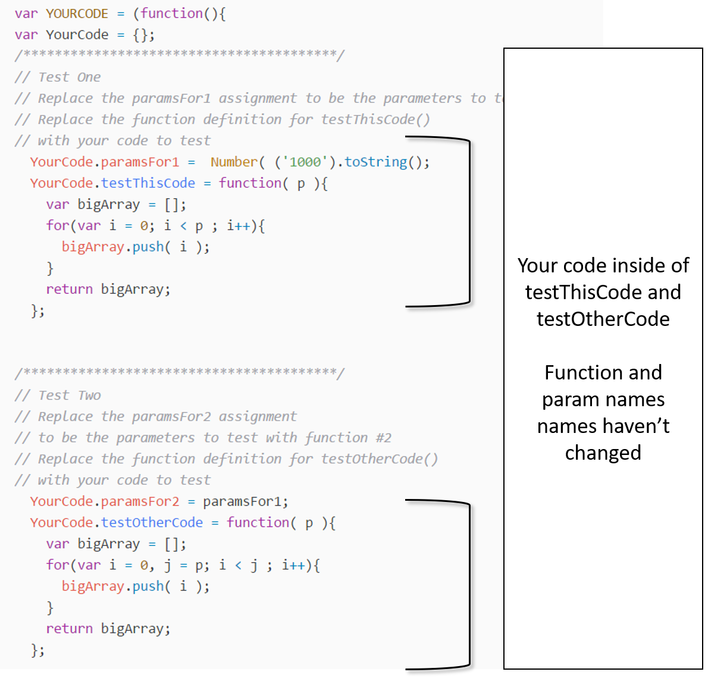

# SPEED TEST
Test how fast your code goes
[See the site here](https://krosenk729.github.io/Speed-Test/)

### Clone This Repo

```
git clone https://github.com/krosenk729/Speed-Test.git
cd Speed-Test
```

1. Open Speed-Test/js/**your-code.js**
2. Update the function definitions for ```YourCode.testThisCode``` and ```YourCode.testOtherCode``` by replacing the console.log statements with whatever you want to test
3. Update the parameters for your functions by changing the assignment to ```YourCode.paramsFor1``` and ```YourCode.paramsFor2``` 
4. Hit save then open up Speed-Test/index.html

### Example


